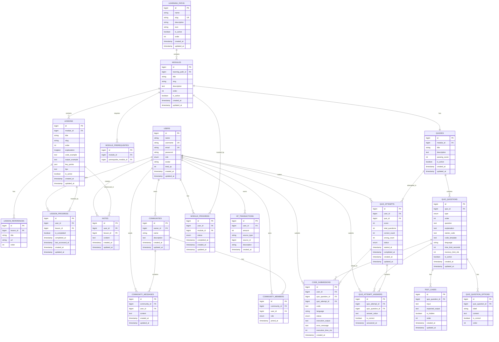

# Database Schema — Sintaks

> **Versi:** 1.0 — MVP
> **Status:** Draft
> **Referensi:** PRD.md v1.0 · ARCHITECTURE.md v1.0
> **Database:** MySQL
> **ORM:** Laravel 12 Eloquent
> **Management Tool:** phpMyAdmin (developer only)

---

## Daftar Isi

1. [Database Overview](#1-database-overview)
2. [Naming Convention](#2-naming-convention)
3. [Entity Relationship Diagram](#3-entity-relationship-diagram)
4. [Tabel: users](#4-tabel-users)
5. [Tabel: learning_paths](#5-tabel-learning_paths)
6. [Tabel: modules](#6-tabel-modules)
7. [Tabel: module_prerequisites](#7-tabel-module_prerequisites)
8. [Tabel: lessons](#8-tabel-lessons)
9. [Tabel: lesson_progress](#9-tabel-lesson_progress)
10. [Tabel: notes](#10-tabel-notes)
11. [NOVA Schema](#11-nova-schema)
12. [Tabel: quizzes](#12-tabel-quizzes)
13. [Tabel: quiz_questions](#13-tabel-quiz_questions)
14. [Tabel: quiz_question_options](#14-tabel-quiz_question_options)
15. [Tabel: test_cases](#15-tabel-test_cases)
16. [Tabel: quiz_attempts](#16-tabel-quiz_attempts)
17. [Tabel: quiz_attempt_answers](#17-tabel-quiz_attempt_answers)
18. [Tabel: code_submissions](#18-tabel-code_submissions)
19. [Tabel: module_progress](#19-tabel-module_progress)
20. [Tabel: xp_transactions](#20-tabel-xp_transactions)
21. [Tabel: communities](#21-tabel-communities)
22. [Tabel: community_members](#22-tabel-community_members)
23. [Tabel: community_messages](#23-tabel-community_messages)
24. [Indexing Strategy](#24-indexing-strategy)
25. [Foreign Key & Delete Behavior](#25-foreign-key--delete-behavior)
26. [Data Ownership](#26-data-ownership)
27. [Normalization](#27-normalization)
28. [Transaction Requirements](#28-transaction-requirements)
29. [Concurrency Considerations](#29-concurrency-considerations)
30. [Migration Order](#30-migration-order)
31. [Seed Data](#31-seed-data)
32. [Database Rules](#32-database-rules)
33. [Security Considerations](#33-security-considerations)
34. [What Is Not Stored](#34-what-is-not-stored)
35. [Future Extensibility](#35-future-extensibility)
36. [Final Schema Checklist](#36-final-schema-checklist)

---

## 1. Database Overview

### Gambaran Struktur Data

```
User
│
├── Profile (dalam tabel users)
├── Notes ──────────────────────────────────── Lesson
├── Lesson Progress ────────────────────────── Lesson
├── Module Progress ────────────────────────── Module
├── Quiz Attempts ──────────────────────────── Quiz
│     └── Quiz Attempt Answers ──────────────── Quiz Question
├── Code Submissions ───────────────────────── Quiz Question
├── XP Transactions
└── Community Memberships
        │
        ▼
    Community
        │
        └── Community Messages

Learning Path
│
└── Modules (ordered, prerequisite)
      │
      ├── Lessons (ordered)
      │      └── Notes (per user)
      │      └── Lesson Progress (per user)
      │
      └── Quiz (satu quiz per module)
             └── Quiz Questions
                    │
                    ├── THEORY
                    │     └── quiz_question_options (pilihan A/B/C/D)
                    │
                    ├── CODE_WRITING
                    │     └── test_cases (public & hidden)
                    │
                    └── CODE_COMPLETION
                          ├── quiz_question_options (token pilihan)
                          └── test_cases (public & hidden)
```

### Ringkasan Tabel

| # | Tabel | Domain | Keterangan |
|---|-------|--------|------------|
| 1 | `users` | Auth & Profile | User dan data profile (termasuk avatar) |
| 2 | `learning_paths` | Learning | Daftar learning path (Python, dll.) |
| 3 | `modules` | Learning | Module dalam learning path |
| 4 | `module_prerequisites` | Learning | Prerequisite antar module |
| 5 | `lessons` | Learning | Lesson dalam module |
| 6 | `lesson_progress` | Progress | Status completion lesson per user |
| 7 | `notes` | Notes | Catatan pribadi user per lesson |
| 8 | `quizzes` | Quiz | Quiz yang terhubung ke module |
| 9 | `quiz_questions` | Quiz | Soal quiz (semua tipe) |
| 10 | `quiz_question_options` | Quiz | Pilihan jawaban theory & token code completion |
| 11 | `test_cases` | Code Exec | Test case untuk soal coding |
| 12 | `quiz_attempts` | Quiz | Percobaan quiz per user |
| 13 | `quiz_attempt_answers` | Quiz | Jawaban per soal per attempt |
| 14 | `code_submissions` | Code Exec | Submission kode dari user |
| 15 | `module_progress` | Progress | Status completion module per user |
| 16 | `xp_transactions` | Gamification | Riwayat perolehan XP |
| 17 | `communities` | Community | Data community |
| 18 | `community_members` | Community | Keanggotaan user dalam community |
| 19 | `community_messages` | Community | Pesan dalam community |

---

## 2. Naming Convention

Seluruh nama tabel dan kolom mengikuti konvensi Laravel standar.

**Tabel:** `snake_case`, plural

```
users
learning_paths
modules
lessons
quiz_questions
quiz_question_options
community_members
community_messages
```

**Primary Key:** selalu `id` dengan tipe `BIGINT UNSIGNED AUTO_INCREMENT`

**Foreign Key:** nama tabel singular + `_id`

```
user_id
learning_path_id
module_id
lesson_id
quiz_id
quiz_question_id
community_id
```

**Timestamps:** Laravel default `created_at` dan `updated_at` (`TIMESTAMP`)

**Boolean:** `TINYINT(1)` — Laravel memetakan ini sebagai `boolean`

**Soft Delete:** Tidak digunakan secara default. Soft delete hanya dipertimbangkan jika ada kebutuhan audit trail yang jelas. Pada MVP ini tidak diperlukan; data yang dihapus benar-benar dihapus dari database.

**Alasan menghindari soft delete secara default:** Soft delete menambah kompleksitas query (setiap query harus menyertakan `WHERE deleted_at IS NULL`), dapat menyebabkan data lama yang tidak terpakai menumpuk, dan tidak ada requirement audit trail di PRD.

---

## 3. Entity Relationship Diagram



---

## 4. Tabel: `users`

### Purpose

Tabel utama yang menyimpan seluruh data pengguna Sintaks, termasuk kredensial autentikasi, role, informasi profil, dan total XP. Profile tidak dipisahkan ke tabel terpisah karena semua field profile bersifat 1:1 dengan user dan tidak ada kompleksitas yang membenarkan tabel tersendiri pada MVP.

### Columns

| Column | Type | Null | Default | Key | Description |
|--------|------|------|---------|-----|-------------|
| `id` | `BIGINT UNSIGNED` | NO | — | PK | Primary key, auto increment |
| `name` | `VARCHAR(100)` | NO | — | — | Nama lengkap atau display name user |
| `username` | `VARCHAR(50)` | NO | — | UQ | Username unik untuk identifikasi dan profil |
| `email` | `VARCHAR(255)` | NO | — | UQ | Email untuk login dan password reset |
| `password` | `VARCHAR(255)` | NO | — | — | Password ter-hash (bcrypt) |
| `role` | `ENUM('user','admin')` | NO | `'user'` | IDX | Role akses user dalam sistem |
| `avatar` | `VARCHAR(100)` | YES | `NULL` | — | Key/identifier avatar preset yang dipilih |
| `total_xp` | `INT UNSIGNED` | NO | `0` | — | Total XP terakumulasi — denormalized untuk akses cepat |
| `email_verified_at` | `TIMESTAMP` | YES | `NULL` | — | Waktu verifikasi email (dikelola Laravel) |
| `remember_token` | `VARCHAR(100)` | YES | `NULL` | — | Token remember me (dikelola Laravel) |
| `created_at` | `TIMESTAMP` | YES | `NULL` | — | Waktu akun dibuat |
| `updated_at` | `TIMESTAMP` | YES | `NULL` | — | Waktu akun terakhir diperbarui |

### Keputusan Desain

**Avatar sebagai key string, bukan path file:**
Avatar diimplementasikan sebagai pilihan dari avatar preset (kumpulan avatar yang sudah tersedia di frontend). Kolom `avatar` menyimpan identifier string (misalnya `avatar_01`, `avatar_python`) yang digunakan frontend untuk menampilkan gambar yang sesuai. Tidak ada upload file dari user, tidak ada binary data di database.

**Role sebagai ENUM:**
Role MVP hanya memiliki dua nilai yang stabil (`user` dan `admin`). ENUM dipilih karena nilainya terbatas, tidak akan berubah di MVP, dan memberikan constraint langsung di level database. Jika di masa depan role bertambah (misalnya `moderator`), kolom dapat di-ALTER atau dimigrasi ke tabel roles terpisah.

**total_xp di tabel users:**
Kolom `total_xp` adalah denormalized data yang disimpan untuk kemudahan akses cepat (dashboard, profil). Nilai ini selalu diperbarui secara atomik bersamaan dengan insert ke `xp_transactions`. Tidak perlu query agregat `SUM` setiap kali menampilkan total XP.

**Profile dalam satu tabel:**
Field profil (`name`, `username`, `avatar`) disatukan dalam tabel `users` karena relasi 1:1 sederhana dan tidak ada kebutuhan untuk tabel profil terpisah pada MVP. Memisahkannya hanya menambah JOIN yang tidak perlu.

### Constraints

- `PRIMARY KEY (id)`
- `UNIQUE (email)`
- `UNIQUE (username)`

### Indexes

- `INDEX (role)` — digunakan untuk middleware cek admin
- `UNIQUE INDEX (email)` — login lookup
- `UNIQUE INDEX (username)` — profil lookup

### Relationships (Eloquent)

- `hasMany(LessonProgress::class)`
- `hasMany(Note::class)`
- `hasMany(QuizAttempt::class)`
- `hasMany(CodeSubmission::class)`
- `hasMany(ModuleProgress::class)`
- `hasMany(XpTransaction::class)`
- `hasMany(CommunityMember::class)`
- `hasMany(CommunityMessage::class)`
- `hasMany(Community::class, 'owner_id')`

---

## 5. Tabel: `learning_paths`

### Purpose

Menyimpan daftar learning path yang tersedia di Sintaks. Pada MVP hanya terdapat satu learning path (Python), namun tabel dirancang agar learning path baru dapat ditambahkan tanpa perubahan skema.

### Columns

| Column | Type | Null | Default | Key | Description |
|--------|------|------|---------|-----|-------------|
| `id` | `BIGINT UNSIGNED` | NO | — | PK | Primary key |
| `name` | `VARCHAR(100)` | NO | — | — | Nama learning path, misal: "Python" |
| `slug` | `VARCHAR(120)` | NO | — | UQ | URL-friendly identifier, misal: "python" |
| `description` | `TEXT` | YES | `NULL` | — | Deskripsi singkat learning path |
| `icon` | `VARCHAR(100)` | YES | `NULL` | — | Key ikon atau nama file ikon |
| `is_active` | `TINYINT(1)` | NO | `1` | IDX | Menentukan apakah learning path ditampilkan |
| `order` | `INT UNSIGNED` | NO | `0` | — | Urutan tampilan jika ada lebih dari satu |
| `created_at` | `TIMESTAMP` | YES | `NULL` | — | — |
| `updated_at` | `TIMESTAMP` | YES | `NULL` | — | — |

### Constraints

- `PRIMARY KEY (id)`
- `UNIQUE (slug)`

### Indexes

- `UNIQUE INDEX (slug)` — untuk routing dan lookup
- `INDEX (is_active)` — filter untuk tampilan publik

### Relationships (Eloquent)

- `hasMany(Module::class)`

---

## 6. Tabel: `modules`

### Purpose

Menyimpan module dalam sebuah learning path. Setiap module memiliki urutan yang menentukan alur pembelajaran. Module dapat memiliki prerequisite yang tersimpan di tabel `module_prerequisites`.

### Columns

| Column | Type | Null | Default | Key | Description |
|--------|------|------|---------|-----|-------------|
| `id` | `BIGINT UNSIGNED` | NO | — | PK | Primary key |
| `learning_path_id` | `BIGINT UNSIGNED` | NO | — | FK, IDX | Referensi ke learning path |
| `title` | `VARCHAR(200)` | NO | — | — | Judul module |
| `slug` | `VARCHAR(220)` | NO | — | — | URL-friendly identifier (unik dalam scope learning path) |
| `description` | `TEXT` | YES | `NULL` | — | Deskripsi singkat module |
| `order` | `INT UNSIGNED` | NO | `0` | — | Urutan module dalam learning path |
| `is_active` | `TINYINT(1)` | NO | `1` | — | Admin dapat menonaktifkan module sementara |
| `created_at` | `TIMESTAMP` | YES | `NULL` | — | — |
| `updated_at` | `TIMESTAMP` | YES | `NULL` | — | — |

### Constraints

- `PRIMARY KEY (id)`
- `FOREIGN KEY (learning_path_id) REFERENCES learning_paths(id) ON DELETE CASCADE`
- `UNIQUE (learning_path_id, slug)` — slug unik dalam scope satu learning path

### Indexes

- `INDEX (learning_path_id)` — join dengan learning paths
- `INDEX (learning_path_id, order)` — pengurutan module dalam learning path
- `UNIQUE INDEX (learning_path_id, slug)`

### Relationships (Eloquent)

- `belongsTo(LearningPath::class)`
- `hasMany(Lesson::class)`
- `hasOne(Quiz::class)`
- `hasMany(ModuleProgress::class)`
- `belongsToMany(Module::class, 'module_prerequisites', 'module_id', 'prerequisite_module_id')->as('prerequisites')`

---

## 7. Tabel: `module_prerequisites`

### Purpose

Menyimpan relasi prerequisite antar module. Sebuah module dapat memiliki lebih dari satu prerequisite. Desain ini dipilih menggunakan tabel relasi terpisah (bukan kolom self-referencing `prerequisite_module_id` di tabel `modules`) agar fleksibel mendukung multiple prerequisite tanpa perubahan skema.

> **Catatan:** Pada MVP Python, setiap module umumnya hanya memiliki satu prerequisite (module sebelumnya secara berurutan). Namun tabel ini dirancang untuk mendukung skenario yang lebih kompleks di masa depan tanpa perlu redesign.

### Columns

| Column | Type | Null | Default | Key | Description |
|--------|------|------|---------|-----|-------------|
| `id` | `BIGINT UNSIGNED` | NO | — | PK | Primary key |
| `module_id` | `BIGINT UNSIGNED` | NO | — | FK, IDX | Module yang memerlukan prerequisite |
| `prerequisite_module_id` | `BIGINT UNSIGNED` | NO | — | FK, IDX | Module yang harus diselesaikan terlebih dahulu |

### Constraints

- `PRIMARY KEY (id)`
- `FOREIGN KEY (module_id) REFERENCES modules(id) ON DELETE CASCADE`
- `FOREIGN KEY (prerequisite_module_id) REFERENCES modules(id) ON DELETE CASCADE`
- `UNIQUE (module_id, prerequisite_module_id)` — mencegah duplikasi relasi

### Catatan Circular Dependency

Validasi circular dependency (misalnya Module A membutuhkan Module B, dan Module B membutuhkan Module A) harus dilakukan di application layer (Laravel Service), bukan di level database. MySQL tidak memiliki mekanisme native untuk mendeteksi circular reference pada tabel ini.

### Relationships (Eloquent)

Diakses melalui `belongsToMany` pada model `Module`.

---

## 8. Tabel: `lessons`

### Purpose

Menyimpan materi pembelajaran dalam sebuah module. Setiap lesson berisi konten yang terdiri dari beberapa elemen (explanation, code example, output, key points, tips). References disimpan di tabel terpisah `lesson_references`.

### Columns

| Column | Type | Null | Default | Key | Description |
|--------|------|------|---------|-----|-------------|
| `id` | `BIGINT UNSIGNED` | NO | — | PK | Primary key |
| `module_id` | `BIGINT UNSIGNED` | NO | — | FK, IDX | Referensi ke module |
| `title` | `VARCHAR(200)` | NO | — | — | Judul lesson |
| `slug` | `VARCHAR(220)` | NO | — | — | URL-friendly identifier |
| `order` | `INT UNSIGNED` | NO | `0` | — | Urutan lesson dalam module |
| `explanation` | `LONGTEXT` | YES | `NULL` | — | Penjelasan konsep utama (dapat berisi Markdown) |
| `code_example` | `TEXT` | YES | `NULL` | — | Contoh kode yang relevan |
| `output_example` | `TEXT` | YES | `NULL` | — | Output dari contoh kode |
| `key_points` | `JSON` | YES | `NULL` | — | Poin-poin penting (array string) |
| `tips` | `TEXT` | YES | `NULL` | — | Saran praktis terkait materi |
| `common_mistakes` | `TEXT` | YES | `NULL` | — | Kesalahan umum yang sering dilakukan pemula |
| `is_active` | `TINYINT(1)` | NO | `1` | — | Admin dapat menonaktifkan lesson |
| `created_at` | `TIMESTAMP` | YES | `NULL` | — | — |
| `updated_at` | `TIMESTAMP` | YES | `NULL` | — | — |

### Keputusan Desain Field Konten

**`explanation` sebagai `LONGTEXT`:**
Penjelasan konsep bisa panjang dan mengandung Markdown. `LONGTEXT` mendukung hingga 4GB, cukup untuk konten lesson apapun.

**`code_example` dan `output_example` sebagai `TEXT`:**
Contoh kode dan output biasanya tidak panjang. `TEXT` mendukung hingga 65KB, cukup untuk keperluan lesson.

**`key_points` sebagai `JSON`:**
Key points adalah list item yang pendek-pendek (array of strings). JSON dipilih karena:
- Struktur datanya adalah array string sederhana, bukan entitas relasional yang perlu di-query secara individual
- Tidak ada kebutuhan untuk mencari atau memfilter berdasarkan isi key points individual
- Tidak perlu tabel terpisah hanya untuk list string sederhana
- Laravel mengelola serialize/deserialize JSON secara otomatis melalui `$casts`

Contoh nilai: `["range(5) menghasilkan 0-4", "for loop menggunakan in keyword"]`

**`tips` sebagai `TEXT`:**
Tips berupa paragraf tunggal atau beberapa baris teks. TEXT sudah cukup.

**`common_mistakes` sebagai `TEXT`:**
Kesalahan umum berupa teks deskriptif, cukup dengan TEXT.

**References di tabel terpisah (`lesson_references`):**
References adalah daftar URL dengan judul yang dapat berjumlah lebih dari satu dan mungkin perlu dikelola (tambah/hapus individual) oleh admin. Oleh karena itu disimpan di tabel terpisah, bukan JSON.

### Constraints

- `PRIMARY KEY (id)`
- `FOREIGN KEY (module_id) REFERENCES modules(id) ON DELETE CASCADE`
- `UNIQUE (module_id, slug)` — slug unik dalam scope satu module

### Indexes

- `INDEX (module_id)` — join dengan module
- `INDEX (module_id, order)` — pengurutan lesson dalam module
- `UNIQUE INDEX (module_id, slug)`

### Relationships (Eloquent)

- `belongsTo(Module::class)`
- `hasMany(Note::class)`
- `hasMany(LessonProgress::class)`
- `hasMany(LessonReference::class)`

---

### Tabel: `lesson_references`

Tabel pendukung untuk menyimpan referensi/sumber bacaan lesson.

| Column | Type | Null | Default | Key | Description |
|--------|------|------|---------|-----|-------------|
| `id` | `BIGINT UNSIGNED` | NO | — | PK | Primary key |
| `lesson_id` | `BIGINT UNSIGNED` | NO | — | FK, IDX | Referensi ke lesson |
| `title` | `VARCHAR(200)` | NO | — | — | Judul referensi |
| `url` | `VARCHAR(500)` | NO | — | — | URL sumber referensi |
| `order` | `INT UNSIGNED` | NO | `0` | — | Urutan tampilan referensi |

**Constraints:** `PRIMARY KEY (id)`, `FOREIGN KEY (lesson_id) REFERENCES lessons(id) ON DELETE CASCADE`

---

## 9. Tabel: `lesson_progress`

### Purpose

Melacak status completion setiap lesson per user. Tabel ini adalah dasar perhitungan progress module dan fitur "Continue Learning" pada dashboard.

### Columns

| Column | Type | Null | Default | Key | Description |
|--------|------|------|---------|-----|-------------|
| `id` | `BIGINT UNSIGNED` | NO | — | PK | Primary key |
| `user_id` | `BIGINT UNSIGNED` | NO | — | FK, IDX | Referensi ke user |
| `lesson_id` | `BIGINT UNSIGNED` | NO | — | FK, IDX | Referensi ke lesson |
| `is_completed` | `TINYINT(1)` | NO | `0` | — | Status completion lesson |
| `completed_at` | `TIMESTAMP` | YES | `NULL` | — | Waktu lesson diselesaikan |
| `last_accessed_at` | `TIMESTAMP` | YES | `NULL` | — | Waktu terakhir lesson diakses (untuk Continue Learning) |
| `created_at` | `TIMESTAMP` | YES | `NULL` | — | Waktu pertama kali lesson dibuka |
| `updated_at` | `TIMESTAMP` | YES | `NULL` | — | Waktu terakhir diperbarui |

### Constraints

- `PRIMARY KEY (id)`
- `FOREIGN KEY (user_id) REFERENCES users(id) ON DELETE CASCADE`
- `FOREIGN KEY (lesson_id) REFERENCES lessons(id) ON DELETE CASCADE`
- `UNIQUE (user_id, lesson_id)` — satu record per user per lesson

### Indexes

- `UNIQUE INDEX (user_id, lesson_id)` — lookup progress spesifik
- `INDEX (user_id, last_accessed_at)` — untuk fitur Continue Learning (ambil lesson terakhir diakses)
- `INDEX (lesson_id)` — join ketika menghitung completion per lesson

### Relationships (Eloquent)

- `belongsTo(User::class)`
- `belongsTo(Lesson::class)`

---

## 10. Tabel: `notes`

### Purpose

Menyimpan catatan pribadi user yang dibuat saat membaca lesson. Setiap note terhubung ke lesson asal untuk memungkinkan navigasi kembali ke materi.

### Columns

| Column | Type | Null | Default | Key | Description |
|--------|------|------|---------|-----|-------------|
| `id` | `BIGINT UNSIGNED` | NO | — | PK | Primary key |
| `user_id` | `BIGINT UNSIGNED` | NO | — | FK, IDX | Pemilik note |
| `lesson_id` | `BIGINT UNSIGNED` | NO | — | FK, IDX | Lesson asal note dibuat |
| `content` | `TEXT` | NO | — | — | Isi catatan user |
| `created_at` | `TIMESTAMP` | YES | `NULL` | — | — |
| `updated_at` | `TIMESTAMP` | YES | `NULL` | — | — |

### Keputusan Desain

PRD mendefinisikan operasi note sebagai create, read, dan delete. Update/edit note tidak disebutkan di PRD. Kolom `updated_at` tetap ada karena Laravel mengelolanya secara default dan tidak ada overhead berarti. Jika fitur edit note ditambahkan di masa depan, kolom sudah tersedia.

### Constraints

- `PRIMARY KEY (id)`
- `FOREIGN KEY (user_id) REFERENCES users(id) ON DELETE CASCADE`
- `FOREIGN KEY (lesson_id) REFERENCES lessons(id) ON DELETE CASCADE`

### Indexes

- `INDEX (user_id)` — mengambil seluruh note milik satu user
- `INDEX (lesson_id)` — mengambil note untuk lesson tertentu
- `INDEX (user_id, lesson_id)` — composite index untuk query notes per user per lesson

### Authorization

Seluruh query notes harus menyertakan `WHERE user_id = auth()->id()`. `NotePolicy` di Laravel memverifikasi kepemilikan sebelum operasi delete.

### Relationships (Eloquent)

- `belongsTo(User::class)`
- `belongsTo(Lesson::class)`

---

## 11. NOVA Schema

### Keputusan: Apakah Riwayat Percakapan NOVA Perlu Disimpan?

Berdasarkan PRD dan ARCHITECTURE.md, NOVA menggunakan **context injection** langsung dari database pada setiap request. Konteks dibangun saat request terjadi, bukan dari riwayat yang tersimpan.

**Untuk MVP, riwayat percakapan NOVA tidak disimpan di database.**

Alasan:
1. PRD tidak menyebutkan kebutuhan untuk melihat riwayat percakapan NOVA sebelumnya
2. ARCHITECTURE.md menegaskan pendekatan context injection — konteks dibangun fresh setiap request
3. Menyimpan seluruh conversation history menambah volume data yang besar tanpa manfaat yang jelas di MVP
4. Konteks percakapan dalam satu sesi sudah cukup dikelola di sisi client (React menyimpan conversation state selama sesi aktif dan mengirimkannya kembali ke server jika diperlukan untuk multi-turn conversation)

**Tidak ada tabel `nova_conversations` atau `nova_messages` pada MVP.**

**Penting:** Tidak ada kolom `quiz_id` atau relasi apapun antara NOVA dengan tabel quiz. NOVA tidak tersedia di Quiz.

### Multi-turn Conversation (Opsional, dalam satu sesi)

Jika diperlukan untuk mendukung percakapan multi-turn dalam satu sesi lesson (user bertanya beberapa kali), riwayat pesan dalam satu sesi dapat dikirim oleh React ke Laravel sebagai bagian dari payload request (array messages dalam format `[{role, content}]`), lalu diteruskan ke AI Provider. Ini adalah stateless approach yang tidak memerlukan penyimpanan database.

---

## 12. Tabel: `quizzes`

### Purpose

Setiap module memiliki tepat satu quiz. Quiz diakses setelah semua lesson dalam module diselesaikan. Tabel ini menyimpan metadata quiz per module.

### Columns

| Column | Type | Null | Default | Key | Description |
|--------|------|------|---------|-----|-------------|
| `id` | `BIGINT UNSIGNED` | NO | — | PK | Primary key |
| `module_id` | `BIGINT UNSIGNED` | NO | — | FK, UQ | Referensi ke module (satu quiz per module) |
| `title` | `VARCHAR(200)` | NO | — | — | Judul quiz |
| `description` | `TEXT` | YES | `NULL` | — | Deskripsi atau instruksi quiz |
| `passing_score` | `INT UNSIGNED` | NO | `70` | — | Persentase minimum untuk dinyatakan lulus |
| `is_active` | `TINYINT(1)` | NO | `1` | — | Status aktif quiz |
| `created_at` | `TIMESTAMP` | YES | `NULL` | — | — |
| `updated_at` | `TIMESTAMP` | YES | `NULL` | — | — |

### Constraints

- `PRIMARY KEY (id)`
- `FOREIGN KEY (module_id) REFERENCES modules(id) ON DELETE CASCADE`
- `UNIQUE (module_id)` — satu quiz per module

### Indexes

- `UNIQUE INDEX (module_id)`

### Relationships (Eloquent)

- `belongsTo(Module::class)`
- `hasMany(QuizQuestion::class)`
- `hasMany(QuizAttempt::class)`

---

## 13. Tabel: `quiz_questions`

### Purpose

Menyimpan semua soal quiz dalam satu tabel dengan kolom `type` untuk membedakan jenis soal. Pendekatan **single table** dipilih karena tiga tipe soal berbagi banyak field umum, dan overhead dari tabel terpisah per tipe tidak sebanding dengan manfaatnya di MVP.

Soal THEORY menggunakan: `question`, `explanation`, dan pilihan di `quiz_question_options`
Soal CODE_WRITING menggunakan: `question`, `starter_code`, `language`, `time_limit_seconds`, `memory_limit_mb`, dan test cases di `test_cases`
Soal CODE_COMPLETION menggunakan: `question`, `code_template`, `language`, `time_limit_seconds`, `memory_limit_mb`, token pilihan di `quiz_question_options`, dan test cases di `test_cases`

### Columns

| Column | Type | Null | Default | Key | Description |
|--------|------|------|---------|-----|-------------|
| `id` | `BIGINT UNSIGNED` | NO | — | PK | Primary key |
| `quiz_id` | `BIGINT UNSIGNED` | NO | — | FK, IDX | Referensi ke quiz |
| `type` | `ENUM('theory','code_writing','code_completion')` | NO | — | IDX | Tipe soal |
| `order` | `INT UNSIGNED` | NO | `0` | — | Urutan soal dalam quiz |
| `question` | `TEXT` | NO | — | — | Teks pertanyaan atau deskripsi problem |
| `explanation` | `TEXT` | YES | `NULL` | — | Penjelasan jawaban benar (untuk theory) |
| `starter_code` | `TEXT` | YES | `NULL` | — | Kode awal untuk CODE_WRITING (opsional) |
| `code_template` | `TEXT` | YES | `NULL` | — | Template kode dengan placeholder untuk CODE_COMPLETION |
| `language` | `VARCHAR(20)` | NO | `'python'` | — | Bahasa pemrograman soal (MVP: selalu 'python') |
| `time_limit_seconds` | `INT UNSIGNED` | YES | `10` | — | Batas waktu eksekusi kode (detik) |
| `memory_limit_mb` | `INT UNSIGNED` | YES | `64` | — | Batas memori eksekusi (MB) |
| `is_active` | `TINYINT(1)` | NO | `1` | — | Status aktif soal |
| `created_at` | `TIMESTAMP` | YES | `NULL` | — | — |
| `updated_at` | `TIMESTAMP` | YES | `NULL` | — | — |

### Penjelasan Nullable berdasarkan Tipe

| Field | THEORY | CODE_WRITING | CODE_COMPLETION |
|-------|--------|--------------|-----------------|
| `question` | ✅ Wajib | ✅ Wajib | ✅ Wajib |
| `explanation` | ✅ Disarankan | ❌ Tidak digunakan | ❌ Tidak digunakan |
| `starter_code` | ❌ Tidak digunakan | ⚪ Opsional | ❌ Tidak digunakan |
| `code_template` | ❌ Tidak digunakan | ❌ Tidak digunakan | ✅ Wajib |
| `time_limit_seconds` | ❌ Tidak digunakan | ✅ Wajib | ✅ Wajib |
| `memory_limit_mb` | ❌ Tidak digunakan | ✅ Wajib | ✅ Wajib |

### Format `code_template` untuk Code Completion

`code_template` menyimpan kode dengan placeholder untuk slot kosong. Gunakan marker yang konsisten, misalnya `___BLANK_1___`, `___BLANK_2___`. Frontend mengganti marker ini dengan input user.

Contoh:
```
___BLANK_1___ i in ___BLANK_2___:
    if i % ___BLANK_3___ == 0:
        print(i)
```

### Constraints

- `PRIMARY KEY (id)`
- `FOREIGN KEY (quiz_id) REFERENCES quizzes(id) ON DELETE CASCADE`

### Indexes

- `INDEX (quiz_id)` — mengambil soal per quiz
- `INDEX (quiz_id, order)` — pengurutan soal
- `INDEX (type)` — filter berdasarkan tipe

### Relationships (Eloquent)

- `belongsTo(Quiz::class)`
- `hasMany(QuizQuestionOption::class)`
- `hasMany(TestCase::class)`
- `hasMany(QuizAttemptAnswer::class)`
- `hasMany(CodeSubmission::class)`

---

## 14. Tabel: `quiz_question_options`

### Purpose

Menyimpan pilihan jawaban untuk dua tipe soal:

1. **THEORY** — pilihan A, B, C, D. Field `is_correct` menandai jawaban yang benar.
2. **CODE_COMPLETION** — token pilihan yang dapat dipilih user untuk mengisi slot kosong. Field `is_correct` menandai token yang merupakan jawaban benar untuk setiap posisi (dikombinasikan dengan logika di application layer).

Satu tabel digunakan untuk kedua kebutuhan ini karena strukturnya identik: setiap option memiliki label, konten, flag benar/salah, dan urutan.

### Columns

| Column | Type | Null | Default | Key | Description |
|--------|------|------|---------|-----|-------------|
| `id` | `BIGINT UNSIGNED` | NO | — | PK | Primary key |
| `quiz_question_id` | `BIGINT UNSIGNED` | NO | — | FK, IDX | Referensi ke soal |
| `label` | `VARCHAR(10)` | YES | `NULL` | — | Label opsi (untuk Theory: "A", "B", "C", "D"; untuk Code Completion: kosong atau nama token) |
| `content` | `TEXT` | NO | — | — | Teks pilihan jawaban atau token kode |
| `is_correct` | `TINYINT(1)` | NO | `0` | — | Apakah opsi ini adalah jawaban benar |
| `order` | `INT UNSIGNED` | NO | `0` | — | Urutan tampilan opsi |

### Catatan Penting — Keamanan Data

Field `is_correct` pada tabel ini **tidak boleh dikirim ke frontend** sebelum user menjawab. API Resource Laravel harus mengecualikan field ini dari response yang dikirim ke client. Evaluasi kebenaran jawaban selalu dilakukan di sisi server.

### Constraints

- `PRIMARY KEY (id)`
- `FOREIGN KEY (quiz_question_id) REFERENCES quiz_questions(id) ON DELETE CASCADE`

### Indexes

- `INDEX (quiz_question_id)` — mengambil semua opsi untuk satu soal

### Relationships (Eloquent)

- `belongsTo(QuizQuestion::class)`

---

## 15. Tabel: `test_cases`

### Purpose

Menyimpan test case untuk soal CODE_WRITING dan CODE_COMPLETION. Test case digunakan untuk memvalidasi output kode user. Terdapat dua jenis: public (ditampilkan ke user sebagai referensi) dan hidden (tidak pernah dikirim ke frontend).

### Columns

| Column | Type | Null | Default | Key | Description |
|--------|------|------|---------|-----|-------------|
| `id` | `BIGINT UNSIGNED` | NO | — | PK | Primary key |
| `quiz_question_id` | `BIGINT UNSIGNED` | NO | — | FK, IDX | Referensi ke soal coding |
| `input` | `TEXT` | YES | `NULL` | — | Input yang diberikan ke program (bisa NULL jika program tidak memerlukan input) |
| `expected_output` | `TEXT` | NO | — | — | Output yang diharapkan dari program |
| `is_hidden` | `TINYINT(1)` | NO | `0` | — | Jika TRUE, test case tidak dikirim ke frontend |
| `order` | `INT UNSIGNED` | NO | `0` | — | Urutan eksekusi test case |
| `created_at` | `TIMESTAMP` | YES | `NULL` | — | — |
| `updated_at` | `TIMESTAMP` | YES | `NULL` | — | — |

### Keamanan Hidden Test Case

Ketika API mengembalikan data soal ke frontend:
- Public test cases (`is_hidden = 0`): kirim `input`, `expected_output` (sebagai referensi untuk user)
- Hidden test cases (`is_hidden = 1`): **jangan kirim field apapun ke frontend**

Evaluasi test case selalu dilakukan di server. Response ke client hanya berisi status hasil (correct/wrong/error), bukan isi expected output dari hidden test case.

### Constraints

- `PRIMARY KEY (id)`
- `FOREIGN KEY (quiz_question_id) REFERENCES quiz_questions(id) ON DELETE CASCADE`

### Indexes

- `INDEX (quiz_question_id)` — mengambil test case untuk satu soal
- `INDEX (quiz_question_id, is_hidden)` — filter public vs hidden
- `INDEX (quiz_question_id, order)` — eksekusi berurutan

### Relationships (Eloquent)

- `belongsTo(QuizQuestion::class)`

---

## 16. Tabel: `quiz_attempts`

### Purpose

Mencatat setiap percobaan user mengerjakan sebuah quiz. Setiap kali user memulai quiz baru, satu record attempt dibuat. Record ini menjadi induk dari seluruh jawaban user pada attempt tersebut.

### Columns

| Column | Type | Null | Default | Key | Description |
|--------|------|------|---------|-----|-------------|
| `id` | `BIGINT UNSIGNED` | NO | — | PK | Primary key |
| `user_id` | `BIGINT UNSIGNED` | NO | — | FK, IDX | User yang mengerjakan |
| `quiz_id` | `BIGINT UNSIGNED` | NO | — | FK, IDX | Quiz yang dikerjakan |
| `score` | `INT UNSIGNED` | YES | `NULL` | — | Skor akhir (persentase atau raw score, diisi setelah selesai) |
| `total_questions` | `INT UNSIGNED` | NO | `0` | — | Total jumlah soal dalam quiz saat attempt ini |
| `correct_count` | `INT UNSIGNED` | NO | `0` | — | Jumlah soal yang dijawab benar |
| `wrong_count` | `INT UNSIGNED` | NO | `0` | — | Jumlah soal yang dijawab salah |
| `status` | `ENUM('in_progress','completed','abandoned')` | NO | `'in_progress'` | IDX | Status attempt |
| `started_at` | `TIMESTAMP` | NO | `CURRENT_TIMESTAMP` | — | Waktu attempt dimulai |
| `completed_at` | `TIMESTAMP` | YES | `NULL` | — | Waktu attempt selesai |
| `created_at` | `TIMESTAMP` | YES | `NULL` | — | — |
| `updated_at` | `TIMESTAMP` | YES | `NULL` | — | — |

### Constraints

- `PRIMARY KEY (id)`
- `FOREIGN KEY (user_id) REFERENCES users(id) ON DELETE CASCADE`
- `FOREIGN KEY (quiz_id) REFERENCES quizzes(id) ON DELETE CASCADE`

### Indexes

- `INDEX (user_id)` — riwayat attempt user
- `INDEX (quiz_id)` — semua attempt untuk satu quiz
- `INDEX (user_id, quiz_id)` — attempt user pada quiz tertentu
- `INDEX (user_id, quiz_id, status)` — cek apakah ada attempt yang sedang berjalan

### Relationships (Eloquent)

- `belongsTo(User::class)`
- `belongsTo(Quiz::class)`
- `hasMany(QuizAttemptAnswer::class)`
- `hasMany(CodeSubmission::class)`

---

## 17. Tabel: `quiz_attempt_answers`

### Purpose

Menyimpan jawaban user untuk setiap soal dalam satu quiz attempt. Satu record per soal per attempt.

### Columns

| Column | Type | Null | Default | Key | Description |
|--------|------|------|---------|-----|-------------|
| `id` | `BIGINT UNSIGNED` | NO | — | PK | Primary key |
| `quiz_attempt_id` | `BIGINT UNSIGNED` | NO | — | FK, IDX | Referensi ke quiz attempt |
| `quiz_question_id` | `BIGINT UNSIGNED` | NO | — | FK, IDX | Referensi ke soal |
| `answer_value` | `TEXT` | YES | `NULL` | — | Nilai jawaban user (lihat penjelasan di bawah) |
| `is_correct` | `TINYINT(1)` | YES | `NULL` | — | Hasil evaluasi jawaban |
| `answered_at` | `TIMESTAMP` | NO | `CURRENT_TIMESTAMP` | — | Waktu jawaban disubmit |

### Format `answer_value` per Tipe Soal

| Tipe | Format `answer_value` |
|------|----------------------|
| THEORY | ID dari option yang dipilih, misal: `"3"` (FK ke `quiz_question_options.id`) |
| CODE_WRITING | Tidak digunakan di sini — kode submission disimpan di `code_submissions` |
| CODE_COMPLETION | ID option yang dipilih per slot, misal: `"1,5,3"` (comma-separated option IDs per blank) |

Untuk CODE_WRITING, `answer_value` dapat menyimpan referensi ke `code_submissions.id` (`"submission_id:42"`) atau dapat dikosongkan karena relasi sudah ada melalui `quiz_attempt_id` dan `quiz_question_id` di `code_submissions`.

### Constraints

- `PRIMARY KEY (id)`
- `FOREIGN KEY (quiz_attempt_id) REFERENCES quiz_attempts(id) ON DELETE CASCADE`
- `FOREIGN KEY (quiz_question_id) REFERENCES quiz_questions(id) ON DELETE CASCADE`
- `UNIQUE (quiz_attempt_id, quiz_question_id)` — satu jawaban per soal per attempt

### Indexes

- `INDEX (quiz_attempt_id)` — semua jawaban dalam satu attempt
- `UNIQUE INDEX (quiz_attempt_id, quiz_question_id)`

### Relationships (Eloquent)

- `belongsTo(QuizAttempt::class)`
- `belongsTo(QuizQuestion::class)`

---

## 18. Tabel: `code_submissions`

### Purpose

Mencatat setiap submission kode dari user pada soal CODE_WRITING atau CODE_COMPLETION. User dapat melakukan beberapa kali submission sebelum mendapatkan jawaban yang benar. Tabel ini menyimpan kode yang dikirim, hasil eksekusi, dan status evaluasi.

### Columns

| Column | Type | Null | Default | Key | Description |
|--------|------|------|---------|-----|-------------|
| `id` | `BIGINT UNSIGNED` | NO | — | PK | Primary key |
| `user_id` | `BIGINT UNSIGNED` | NO | — | FK, IDX | User yang mengirim kode |
| `quiz_question_id` | `BIGINT UNSIGNED` | NO | — | FK, IDX | Soal yang sedang dijawab |
| `quiz_attempt_id` | `BIGINT UNSIGNED` | NO | — | FK, IDX | Attempt yang berjalan saat submission |
| `code` | `TEXT` | NO | — | — | Kode yang dikirim user |
| `language` | `VARCHAR(20)` | NO | `'python'` | — | Bahasa pemrograman (MVP: selalu 'python') |
| `status` | `ENUM('pending','running','correct','wrong_answer','syntax_error','runtime_error','timeout','security_violation','execution_error')` | NO | `'pending'` | IDX | Status hasil evaluasi |
| `execution_output` | `TEXT` | YES | `NULL` | — | Output aktual dari eksekusi kode |
| `error_message` | `TEXT` | YES | `NULL` | — | Pesan error jika gagal |
| `execution_time_ms` | `INT UNSIGNED` | YES | `NULL` | — | Waktu eksekusi dalam milidetik |
| `created_at` | `TIMESTAMP` | YES | `NULL` | — | Waktu submission dikirim |

### Keputusan Desain

Kolom `updated_at` tidak disertakan karena submission bersifat immutable setelah evaluasi selesai. Status dapat berubah dari `pending` → `running` → hasil akhir, namun setelah hasil akhir didapat, record tidak diperbarui lagi.

**Apakah semua status perlu disimpan di database?**

Status `pending` dan `running` adalah status transisi yang terjadi selama proses eksekusi berlangsung. Untuk MVP dengan eksekusi synchronous (Laravel menunggu respons dari Code Execution Service), submission langsung mendapatkan status akhir tanpa melewati `pending` dan `running` di database. Namun status ini tetap didefinisikan di ENUM untuk mendukung skenario asynchronous di masa depan (misalnya menggunakan Laravel Queue).

### Constraints

- `PRIMARY KEY (id)`
- `FOREIGN KEY (user_id) REFERENCES users(id) ON DELETE CASCADE`
- `FOREIGN KEY (quiz_question_id) REFERENCES quiz_questions(id) ON DELETE CASCADE`
- `FOREIGN KEY (quiz_attempt_id) REFERENCES quiz_attempts(id) ON DELETE CASCADE`

### Indexes

- `INDEX (user_id)` — riwayat submission user
- `INDEX (quiz_question_id)` — semua submission untuk satu soal
- `INDEX (quiz_attempt_id)` — semua submission dalam satu attempt
- `INDEX (user_id, quiz_question_id, status)` — cek apakah user sudah correct pada soal ini

### Relationships (Eloquent)

- `belongsTo(User::class)`
- `belongsTo(QuizQuestion::class)`
- `belongsTo(QuizAttempt::class)`

---

## 19. Tabel: `module_progress`

### Purpose

Menyimpan status completion module per user. Tabel ini memudahkan penentuan module mana yang locked/unlocked tanpa perlu kalkulasi ulang dari lesson_progress setiap saat.

### Keputusan: Tabel Terpisah vs Kalkulasi Dinamis

**Dipilih: Tabel terpisah**

Trade-off:
- **Kalkulasi dinamis:** Tidak ada data duplikasi, selalu akurat, namun memerlukan JOIN dan kalkulasi setiap kali menampilkan daftar module
- **Tabel terpisah:** Ada risiko inkonsistensi jika tidak diperbarui dengan benar, namun akses lebih cepat dan dapat di-index

Untuk MVP, tabel terpisah dipilih karena modul completion ditampilkan di banyak tempat (dashboard, profil, daftar module) dan kalkulasi dinamis akan membebani database jika tidak di-cache. Status module diperbarui melalui database transaction bersama update lesson_progress dan XP.

### Columns

| Column | Type | Null | Default | Key | Description |
|--------|------|------|---------|-----|-------------|
| `id` | `BIGINT UNSIGNED` | NO | — | PK | Primary key |
| `user_id` | `BIGINT UNSIGNED` | NO | — | FK, IDX | Referensi ke user |
| `module_id` | `BIGINT UNSIGNED` | NO | — | FK, IDX | Referensi ke module |
| `status` | `ENUM('not_started','in_progress','completed')` | NO | `'not_started'` | — | Status progress module |
| `completed_at` | `TIMESTAMP` | YES | `NULL` | — | Waktu module diselesaikan |
| `created_at` | `TIMESTAMP` | YES | `NULL` | — | — |
| `updated_at` | `TIMESTAMP` | YES | `NULL` | — | — |

**Catatan:** Status `locked` tidak disimpan di sini. Locked/unlocked ditentukan secara dinamis oleh `ModuleLockService` dengan memeriksa `module_prerequisites` dan `module_progress` prerequisite. Ini menghindari sinkronisasi state yang kompleks.

### Constraints

- `PRIMARY KEY (id)`
- `FOREIGN KEY (user_id) REFERENCES users(id) ON DELETE CASCADE`
- `FOREIGN KEY (module_id) REFERENCES modules(id) ON DELETE CASCADE`
- `UNIQUE (user_id, module_id)` — satu record per user per module

### Indexes

- `UNIQUE INDEX (user_id, module_id)`
- `INDEX (user_id, status)` — mengambil semua completed module milik user (untuk profil)

### Relationships (Eloquent)

- `belongsTo(User::class)`
- `belongsTo(Module::class)`

---

## 20. Tabel: `xp_transactions`

### Purpose

Mencatat setiap perolehan XP oleh user. Tabel ini berfungsi sebagai audit trail untuk semua perubahan XP. Total XP disimpan juga di `users.total_xp` untuk akses cepat, namun `xp_transactions` adalah sumber kebenaran riwayat.

### Columns

| Column | Type | Null | Default | Key | Description |
|--------|------|------|---------|-----|-------------|
| `id` | `BIGINT UNSIGNED` | NO | — | PK | Primary key |
| `user_id` | `BIGINT UNSIGNED` | NO | — | FK, IDX | User yang mendapatkan XP |
| `amount` | `INT UNSIGNED` | NO | — | — | Jumlah XP yang diperoleh |
| `source_type` | `VARCHAR(50)` | NO | — | IDX | Sumber XP: `lesson_completion`, `quiz_completion`, `coding_correct` |
| `source_id` | `BIGINT UNSIGNED` | NO | — | — | ID entitas sumber (lesson_id, quiz_id, atau quiz_question_id) |
| `description` | `VARCHAR(255)` | YES | `NULL` | — | Deskripsi singkat yang dapat ditampilkan ke user |
| `created_at` | `TIMESTAMP` | YES | `NULL` | — | Waktu XP diperoleh |

### Keputusan: Polymorphic vs source_type + source_id

Laravel menyediakan polymorphic relationship (`morphTo`), namun untuk kasus sederhana ini dengan tiga jenis sumber yang tetap, pendekatan `source_type` string + `source_id` lebih mudah dipahami tanpa memerlukan `morphMap` configuration. Pendekatan ini juga lebih mudah di-query langsung dari phpMyAdmin.

### Idempotency

Sebelum memberikan XP, `XPService` memeriksa apakah sudah ada record dengan `user_id`, `source_type`, dan `source_id` yang sama. Jika sudah ada, XP tidak diberikan ulang. Pemeriksaan ini dilakukan dalam satu database transaction bersama insert `xp_transactions` dan update `users.total_xp`.

### Constraints

- `PRIMARY KEY (id)`
- `FOREIGN KEY (user_id) REFERENCES users(id) ON DELETE CASCADE`
- `UNIQUE (user_id, source_type, source_id)` — mencegah XP ganda dari sumber yang sama

### Indexes

- `INDEX (user_id)` — riwayat XP per user
- `INDEX (user_id, source_type)` — filter berdasarkan jenis aktivitas
- `UNIQUE INDEX (user_id, source_type, source_id)` — idempotency

### Relationships (Eloquent)

- `belongsTo(User::class)`

---

## 21. Tabel: `communities`

### Purpose

Menyimpan data community yang dibuat oleh user. Community adalah ruang diskusi sederhana untuk berbagi pengalaman belajar.

### Columns

| Column | Type | Null | Default | Key | Description |
|--------|------|------|---------|-----|-------------|
| `id` | `BIGINT UNSIGNED` | NO | — | PK | Primary key |
| `owner_id` | `BIGINT UNSIGNED` | NO | — | FK, IDX | User yang membuat dan memiliki community |
| `name` | `VARCHAR(100)` | NO | — | — | Nama community |
| `description` | `TEXT` | YES | `NULL` | — | Deskripsi community |
| `created_at` | `TIMESTAMP` | YES | `NULL` | — | — |
| `updated_at` | `TIMESTAMP` | YES | `NULL` | — | — |

### Catatan: Owner Leave Behavior

PRD belum mendefinisikan secara eksplisit perilaku ketika owner meninggalkan community. Ini adalah **open decision** yang perlu ditentukan sebelum implementasi. Opsi yang umum:
- Owner tidak dapat leave sebelum mentransfer ownership ke member lain
- Jika owner leave, community dihapus (cascade)
- Jika owner leave, salah satu member secara otomatis menjadi owner baru

Implementasi saat ini: owner tidak dapat leave kecuali decision ini telah ditentukan.

### Constraints

- `PRIMARY KEY (id)`
- `FOREIGN KEY (owner_id) REFERENCES users(id) ON DELETE RESTRICT` — community tidak dapat dihapus jika owner dihapus (business decision — user deletion perlu dikelola secara eksplisit)

### Indexes

- `INDEX (owner_id)` — community milik user tertentu

### Relationships (Eloquent)

- `belongsTo(User::class, 'owner_id')`
- `hasMany(CommunityMember::class)`
- `hasMany(CommunityMessage::class)`

---

## 22. Tabel: `community_members`

### Purpose

Menyimpan keanggotaan user dalam community (pivot table dengan metadata). Owner juga tercatat sebagai member dengan role `owner`.

### Columns

| Column | Type | Null | Default | Key | Description |
|--------|------|------|---------|-----|-------------|
| `id` | `BIGINT UNSIGNED` | NO | — | PK | Primary key |
| `community_id` | `BIGINT UNSIGNED` | NO | — | FK, IDX | Referensi ke community |
| `user_id` | `BIGINT UNSIGNED` | NO | — | FK, IDX | Referensi ke user |
| `role` | `ENUM('owner','member')` | NO | `'member'` | — | Role dalam community |
| `joined_at` | `TIMESTAMP` | NO | `CURRENT_TIMESTAMP` | — | Waktu bergabung |

### Catatan: Mengapa Tidak Menggunakan `created_at` / `updated_at`

Record ini tidak di-update setelah dibuat (keanggotaan hanya ada atau tidak ada). `joined_at` lebih deskriptif daripada `created_at` untuk konteks ini.

### Constraints

- `PRIMARY KEY (id)`
- `FOREIGN KEY (community_id) REFERENCES communities(id) ON DELETE CASCADE`
- `FOREIGN KEY (user_id) REFERENCES users(id) ON DELETE CASCADE`
- `UNIQUE (community_id, user_id)` — user tidak dapat join community yang sama dua kali

### Indexes

- `UNIQUE INDEX (community_id, user_id)` — cek membership dan prevent duplicate
- `INDEX (user_id)` — semua community yang diikuti satu user
- `INDEX (community_id)` — semua anggota satu community

### Relationships (Eloquent)

- `belongsTo(Community::class)`
- `belongsTo(User::class)`

---

## 23. Tabel: `community_messages`

### Purpose

Menyimpan pesan yang dikirim dalam community. Pesan ditampilkan secara kronologis. Hanya anggota community yang dapat mengirim dan membaca pesan.

### Columns

| Column | Type | Null | Default | Key | Description |
|--------|------|------|---------|-----|-------------|
| `id` | `BIGINT UNSIGNED` | NO | — | PK | Primary key |
| `community_id` | `BIGINT UNSIGNED` | NO | — | FK, IDX | Community tempat pesan dikirim |
| `user_id` | `BIGINT UNSIGNED` | NO | — | FK, IDX | User yang mengirim pesan |
| `content` | `TEXT` | NO | — | — | Isi pesan |
| `created_at` | `TIMESTAMP` | YES | `NULL` | — | Waktu pesan dikirim (digunakan untuk ordering) |
| `updated_at` | `TIMESTAMP` | YES | `NULL` | — | Waktu terakhir diperbarui (jika fitur edit ditambahkan) |

### Constraints

- `PRIMARY KEY (id)`
- `FOREIGN KEY (community_id) REFERENCES communities(id) ON DELETE CASCADE`
- `FOREIGN KEY (user_id) REFERENCES users(id) ON DELETE CASCADE`

### Indexes

- `INDEX (community_id, created_at)` — mengambil pesan community secara kronologis (paling sering diquery)
- `INDEX (user_id)` — pesan dari satu user

### Pagination

Query pesan community harus menggunakan cursor-based atau offset pagination, diurutkan berdasarkan `created_at DESC` (terbaru di atas) atau `created_at ASC` (kronologis).

### Relationships (Eloquent)

- `belongsTo(Community::class)`
- `belongsTo(User::class)`

---

## 24. Indexing Strategy

### Prinsip

Index hanya dibuat pada kolom yang benar-benar digunakan dalam query WHERE, JOIN, atau ORDER BY yang sering dilakukan. Index yang tidak diperlukan memperlambat operasi INSERT/UPDATE.

### Ringkasan Index

| Tabel | Index | Tipe | Alasan |
|-------|-------|------|--------|
| `users` | `email` | UNIQUE | Login lookup |
| `users` | `username` | UNIQUE | Profil lookup |
| `users` | `role` | Regular | Middleware admin check |
| `learning_paths` | `slug` | UNIQUE | Routing |
| `learning_paths` | `is_active` | Regular | Filter tampilan publik |
| `modules` | `learning_path_id` | Regular | Join ke learning path |
| `modules` | `(learning_path_id, order)` | Composite | Pengurutan module |
| `modules` | `(learning_path_id, slug)` | Unique Composite | Routing dan slug uniqueness |
| `lessons` | `module_id` | Regular | Join ke module |
| `lessons` | `(module_id, order)` | Composite | Pengurutan lesson |
| `lesson_progress` | `(user_id, lesson_id)` | Unique Composite | Lookup progress spesifik |
| `lesson_progress` | `(user_id, last_accessed_at)` | Composite | Continue Learning feature |
| `notes` | `user_id` | Regular | Semua note milik user |
| `notes` | `(user_id, lesson_id)` | Composite | Note per user per lesson |
| `quiz_questions` | `(quiz_id, order)` | Composite | Pengurutan soal |
| `quiz_question_options` | `quiz_question_id` | Regular | Ambil opsi per soal |
| `test_cases` | `(quiz_question_id, is_hidden)` | Composite | Filter public vs hidden |
| `quiz_attempts` | `(user_id, quiz_id)` | Composite | Riwayat attempt per quiz |
| `quiz_attempt_answers` | `(quiz_attempt_id, quiz_question_id)` | Unique Composite | Jawaban per soal per attempt |
| `code_submissions` | `(user_id, quiz_question_id, status)` | Composite | Cek status submission |
| `module_progress` | `(user_id, module_id)` | Unique Composite | Status module per user |
| `xp_transactions` | `user_id` | Regular | Riwayat XP |
| `xp_transactions` | `(user_id, source_type, source_id)` | Unique Composite | Idempotency XP |
| `community_members` | `(community_id, user_id)` | Unique Composite | Cek membership |
| `community_messages` | `(community_id, created_at)` | Composite | Pengambilan pesan kronologis |

---

## 25. Foreign Key & Delete Behavior

| Relasi | FK Column | ON DELETE | Alasan |
|--------|-----------|-----------|--------|
| `modules.learning_path_id` | `learning_path_id` | `CASCADE` | Jika learning path dihapus, seluruh modul ikut terhapus |
| `module_prerequisites.module_id` | `module_id` | `CASCADE` | Jika module dihapus, prerequisite relasinya ikut terhapus |
| `module_prerequisites.prerequisite_module_id` | `prerequisite_module_id` | `CASCADE` | Jika module yang jadi prerequisite dihapus, relasi ikut terhapus |
| `lessons.module_id` | `module_id` | `CASCADE` | Jika module dihapus, semua lesson ikut terhapus |
| `lesson_references.lesson_id` | `lesson_id` | `CASCADE` | Referensi ikut terhapus bersama lesson |
| `lesson_progress.user_id` | `user_id` | `CASCADE` | Progress user terhapus jika user dihapus |
| `lesson_progress.lesson_id` | `lesson_id` | `CASCADE` | Progress terhapus jika lesson dihapus |
| `notes.user_id` | `user_id` | `CASCADE` | Note terhapus jika user dihapus |
| `notes.lesson_id` | `lesson_id` | `CASCADE` | Note terhapus jika lesson dihapus |
| `quizzes.module_id` | `module_id` | `CASCADE` | Quiz terhapus jika module dihapus |
| `quiz_questions.quiz_id` | `quiz_id` | `CASCADE` | Soal terhapus jika quiz dihapus |
| `quiz_question_options.quiz_question_id` | `quiz_question_id` | `CASCADE` | Opsi terhapus jika soal dihapus |
| `test_cases.quiz_question_id` | `quiz_question_id` | `CASCADE` | Test case terhapus jika soal dihapus |
| `quiz_attempts.user_id` | `user_id` | `CASCADE` | Attempt terhapus jika user dihapus |
| `quiz_attempts.quiz_id` | `quiz_id` | `CASCADE` | Attempt terhapus jika quiz dihapus |
| `quiz_attempt_answers.quiz_attempt_id` | `quiz_attempt_id` | `CASCADE` | Jawaban terhapus jika attempt terhapus |
| `code_submissions.user_id` | `user_id` | `CASCADE` | Submission terhapus jika user dihapus |
| `code_submissions.quiz_question_id` | `quiz_question_id` | `CASCADE` | Submission terhapus jika soal dihapus |
| `code_submissions.quiz_attempt_id` | `quiz_attempt_id` | `CASCADE` | Submission terhapus jika attempt terhapus |
| `module_progress.user_id` | `user_id` | `CASCADE` | Progress terhapus jika user dihapus |
| `module_progress.module_id` | `module_id` | `CASCADE` | Progress terhapus jika module dihapus |
| `xp_transactions.user_id` | `user_id` | `CASCADE` | Transaksi XP terhapus jika user dihapus |
| `communities.owner_id` | `owner_id` | `RESTRICT` | Tidak dapat menghapus user yang masih memiliki community |
| `community_members.community_id` | `community_id` | `CASCADE` | Member terhapus jika community dihapus |
| `community_members.user_id` | `user_id` | `CASCADE` | Membership terhapus jika user dihapus |
| `community_messages.community_id` | `community_id` | `CASCADE` | Pesan terhapus jika community dihapus |
| `community_messages.user_id` | `user_id` | `CASCADE` | Pesan tetap ada jika user dihapus (bisa dipertimbangkan SET NULL jika diperlukan) |

> **Catatan `community_messages.user_id`:** Jika pesan harus tetap ada setelah user dihapus (misal untuk menjaga konteks diskusi), gunakan `SET NULL` dan jadikan kolom nullable. Ini adalah business decision yang perlu dikonfirmasi. Default CASCADE dipilih untuk kesederhanaan MVP.

---

## 26. Data Ownership

### User Owns

Data berikut dimiliki oleh user dan hanya dapat diakses/dimodifikasi oleh user yang bersangkutan:

| Data | Tabel | Cara Verifikasi |
|------|-------|-----------------|
| Notes | `notes` | `WHERE user_id = auth()->id()` + NotePolicy |
| Lesson Progress | `lesson_progress` | `WHERE user_id = auth()->id()` |
| Module Progress | `module_progress` | `WHERE user_id = auth()->id()` |
| Quiz Attempts | `quiz_attempts` | `WHERE user_id = auth()->id()` |
| Code Submissions | `code_submissions` | `WHERE user_id = auth()->id()` |
| XP Transactions | `xp_transactions` | `WHERE user_id = auth()->id()` |
| Community Memberships | `community_members` | `WHERE user_id = auth()->id()` |

### Community Owns

| Data | Tabel | Cara Verifikasi |
|------|-------|-----------------|
| Messages | `community_messages` | `WHERE community_id = $id` dan user harus menjadi member |
| Members | `community_members` | `WHERE community_id = $id` |

### Content Ownership (Admin)

Learning Path, Module, Lesson, Quiz, dan Test Case adalah konten platform yang dikelola oleh Admin. User biasa hanya dapat membaca konten ini.

---

## 27. Normalization

Schema dirancang untuk menghindari duplikasi data yang tidak perlu.

**Yang tidak dilakukan:**

| Anti-pattern | Mengapa Tidak Dilakukan |
|-------------|------------------------|
| Menyimpan `module_title` di `lessons` | `module_id` sudah tersedia; judul didapat via JOIN |
| Menyimpan `username` di `notes` | `user_id` sudah tersedia; username didapat via JOIN |
| Menyimpan `lesson_content` di `lesson_progress` | Lesson progress hanya perlu ID dan status |
| Menyimpan `quiz_title` di `quiz_attempts` | `quiz_id` sudah tersedia |
| Menyimpan `correct_answer` di `quiz_attempt_answers` | Jawaban benar ada di `quiz_question_options`; evaluasi di server |
| Duplikasi `expected_output` di `code_submissions` | Expected output ada di `test_cases`; tidak perlu duplikasi |

**Pengecualian yang justified:**

| Denormalization | Alasan |
|----------------|--------|
| `users.total_xp` | Ditampilkan di banyak tempat (dashboard, profil); menghindari agregasi berulang |
| `quiz_attempts.total_questions`, `correct_count`, `wrong_count` | Ringkasan hasil quiz yang sering ditampilkan; menghindari COUNT dari jawaban setiap kali |

---

## 28. Transaction Requirements

Operasi berikut harus dieksekusi dalam satu database transaction agar atomik. Jika salah satu langkah gagal, seluruh operasi di-rollback.

### Lesson Completion + XP

```
BEGIN TRANSACTION

1. INSERT/UPDATE lesson_progress
   (user_id, lesson_id, is_completed = 1, completed_at)

2. UPDATE module_progress
   (recalculate status berdasarkan lesson selesai)

3. INSERT xp_transactions
   (user_id, amount, source_type='lesson_completion', source_id=lesson_id)

4. UPDATE users SET total_xp = total_xp + amount
   WHERE id = user_id

COMMIT
```

### Quiz Completion + XP

```
BEGIN TRANSACTION

1. UPDATE quiz_attempts
   (score, correct_count, wrong_count, status='completed', completed_at)

2. UPDATE module_progress
   (status='completed', completed_at) jika semua lesson dan quiz selesai

3. INSERT xp_transactions
   (user_id, amount, source_type='quiz_completion', source_id=quiz_id)

4. UPDATE users SET total_xp = total_xp + amount

COMMIT
```

### Coding Question Correct + XP

```
BEGIN TRANSACTION

1. UPDATE code_submissions SET status = 'correct'

2. UPDATE quiz_attempt_answers SET is_correct = 1

3. UPDATE quiz_attempts (correct_count++)

4. INSERT xp_transactions
   (user_id, amount, source_type='coding_correct', source_id=quiz_question_id)

5. UPDATE users SET total_xp = total_xp + amount

COMMIT
```

### Join Community

```
BEGIN TRANSACTION

1. CHECK apakah (community_id, user_id) sudah ada di community_members
   Jika ada → rollback dengan error

2. INSERT community_members
   (community_id, user_id, role='member', joined_at)

COMMIT
```

---

## 29. Concurrency Considerations

### XP Double-award

**Skenario:** Dua request bersamaan mencoba memberikan XP dari sumber yang sama (misalnya, double-click "Selesaikan Lesson").

**Mitigasi:** UNIQUE INDEX pada `(user_id, source_type, source_id)` di `xp_transactions` memastikan hanya satu insert yang berhasil. Request kedua akan mendapatkan duplicate key error yang ditangani di application layer.

### Lesson Progress Race Condition

**Skenario:** Dua request bersamaan mencoba menandai lesson yang sama sebagai selesai.

**Mitigasi:** UNIQUE INDEX pada `(user_id, lesson_id)` di `lesson_progress`. Gunakan `INSERT ... ON DUPLICATE KEY UPDATE` atau Eloquent `updateOrCreate()` untuk menghindari race condition.

### Community Membership Duplicate

**Skenario:** User menekan tombol Join dua kali bersamaan.

**Mitigasi:** UNIQUE INDEX pada `(community_id, user_id)` di `community_members`. Request kedua akan gagal dengan duplicate key error yang ditangani gracefully di application layer.

### Quiz Attempt Status

**Skenario:** User mengirim jawaban terakhir dua kali bersamaan, menyebabkan XP diberikan dua kali.

**Mitigasi:** Kombinasi UNIQUE INDEX pada `xp_transactions.(user_id, source_type, source_id)` dan pemeriksaan status quiz_attempt sebelum memberikan XP.

---

## 30. Migration Order

Urutan migration harus mengikuti dependency antar tabel (tabel yang direferensikan harus ada sebelum tabel yang mereferensikan).

```
1.  create_users_table
2.  create_learning_paths_table
3.  create_modules_table
4.  create_module_prerequisites_table
5.  create_lessons_table
6.  create_lesson_references_table
7.  create_lesson_progress_table
8.  create_notes_table
9.  create_quizzes_table
10. create_quiz_questions_table
11. create_quiz_question_options_table
12. create_test_cases_table
13. create_quiz_attempts_table
14. create_quiz_attempt_answers_table
15. create_code_submissions_table
16. create_module_progress_table
17. create_xp_transactions_table
18. create_communities_table
19. create_community_members_table
20. create_community_messages_table
```

**Laravel Sanctum** (untuk tabel `personal_access_tokens`) menggunakan migration bawaan Laravel yang dijalankan sebelum migration custom, atau mengikuti urutan package migration.

---

## 31. Seed Data

Data berikut cocok untuk Laravel Seeder selama development dan demo. Seeder **bukan** untuk production data.

### DatabaseSeeder

```
UserSeeder         → Admin + beberapa User demo
LearningPathSeeder → 1 learning path: Python
ModuleSeeder       → 4 module Python dasar
LessonSeeder       → 3-5 lesson per module
QuizSeeder         → 1 quiz per module dengan 3-5 soal campuran
TestCaseSeeder     → 2-3 test case per soal coding
```

### Contoh Data: Learning Path

```
name: Python
slug: python
description: Belajar programming dari dasar menggunakan bahasa Python
is_active: true
order: 1
```

### Contoh Data: Module

```
Module 01 — Python Fundamentals  (order: 1, prerequisite: none)
Module 02 — Operator             (order: 2, prerequisite: Module 01)
Module 03 — Conditional          (order: 3, prerequisite: Module 02)
Module 04 — Loop                 (order: 4, prerequisite: Module 03)
```

### Contoh Data: Soal Quiz

```
# Theory
type: theory
question: "Apa fungsi keyword 'for' pada Python?"
options:
  - {label: "A", content: "Membuat function", is_correct: false}
  - {label: "B", content: "Melakukan iterasi", is_correct: true}
  - {label: "C", content: "Membuat variable", is_correct: false}
  - {label: "D", content: "Menghapus data", is_correct: false}
explanation: "Keyword 'for' digunakan untuk melakukan iterasi..."

# Code Writing
type: code_writing
question: "Buat program untuk menampilkan angka ganjil dari 1 sampai 10"
starter_code: "# Tulis kode kamu di sini"
language: python
time_limit_seconds: 10
memory_limit_mb: 64

test_cases:
  - {input: "", expected_output: "1\n3\n5\n7\n9", is_hidden: false}
  - {input: "", expected_output: "1\n3\n5\n7\n9", is_hidden: true}
```

---

## 32. Database Rules

Aturan-aturan berikut adalah invariant yang harus dijaga oleh application layer maupun database constraint.

1. **Email unik** — Dua user tidak boleh memiliki email yang sama.
2. **Username unik** — Dua user tidak boleh memiliki username yang sama.
3. **Satu quiz per module** — `UNIQUE (module_id)` pada tabel `quizzes`.
4. **Satu progress per user per lesson** — `UNIQUE (user_id, lesson_id)` pada `lesson_progress`.
5. **Satu progress per user per module** — `UNIQUE (user_id, module_id)` pada `module_progress`.
6. **User hanya mengakses data miliknya** — Seluruh query data personal harus menyertakan `WHERE user_id = auth()->id()` dan didukung Policy.
7. **User harus menjadi member community untuk mengirim pesan** — Divalidasi di `CommunityPolicy` sebelum insert `community_messages`.
8. **User tidak dapat memiliki duplikat membership** — `UNIQUE (community_id, user_id)` pada `community_members`.
9. **Hidden test case tidak dikirim ke frontend** — API Resource harus mengecualikan `expected_output` dari hidden test cases pada response ke client.
10. **`is_correct` pada `quiz_question_options` tidak dikirim ke frontend sebelum user menjawab** — API Resource mengontrol field yang dikembalikan.
11. **XP tidak diberikan dua kali dari sumber yang sama** — `UNIQUE (user_id, source_type, source_id)` pada `xp_transactions`.
12. **`users.total_xp` harus selalu konsisten dengan sum `xp_transactions.amount`** — Keduanya diperbarui dalam satu transaction.
13. **Module dengan prerequisite tidak dapat diakses jika prerequisite belum selesai** — Divalidasi di `ModuleLockService`.
14. **Quiz hanya dapat diakses jika semua lesson dalam module sudah selesai** — Divalidasi di `QuizController`.
15. **NOVA tidak memiliki relasi dengan Quiz** — Tidak ada tabel atau foreign key yang menghubungkan NOVA dengan quiz.
16. **Kode user tidak dieksekusi di server Laravel** — Validasi di application architecture, bukan database.
17. **Circular dependency prerequisite harus dicegah** — Divalidasi di application layer saat admin mengatur prerequisite.

---

## 33. Security Considerations

### Password

- Password disimpan menggunakan `bcrypt` melalui fungsi `Hash::make()` Laravel
- Tidak pernah menyimpan password plaintext
- Kolom `password` tidak pernah dimasukkan dalam API Resource response

### Sensitive Data

- `quiz_question_options.is_correct` tidak dikirim ke frontend sebelum evaluasi
- `test_cases.expected_output` untuk hidden test case tidak dikirim ke frontend
- `users.password` dan `users.remember_token` dikecualikan dari seluruh API response

### phpMyAdmin

- phpMyAdmin tidak boleh di-expose ke publik tanpa proteksi (HTTP auth, IP whitelist, atau VPN)
- Pada production, akses phpMyAdmin harus melalui jaringan internal atau SSH tunnel

### Database Credentials

- Credentials database disimpan di file `.env` yang tidak di-commit ke repository
- `.env` tercantum dalam `.gitignore`

### SQL Injection

- Laravel Eloquent menggunakan prepared statements secara default
- Seluruh query harus menggunakan Eloquent atau Laravel Query Builder, bukan raw SQL dengan string interpolation

---

## 34. What Is Not Stored

Tabel dan kolom berikut **sengaja tidak dibuat** pada MVP. Developer tidak boleh menambahkannya tanpa revisi PRD.

| Yang Tidak Disimpan | Alasan |
|--------------------|--------|
| Streak user | Out of scope PRD |
| Achievement/badge | Out of scope PRD |
| Level user | Out of scope PRD |
| Leaderboard data | Out of scope PRD |
| Programming skills/skill rating user | Out of scope PRD |
| Search history | Out of scope PRD |
| Notification | Out of scope PRD |
| NOVA conversation history | Tidak diperlukan MVP; context injection cukup |
| NOVA quiz integration | NOVA tidak tersedia di Quiz — tidak ada relasi apapun |
| Quiz hints dari AI | Out of scope PRD |
| Private messages | Out of scope PRD |
| Community thread/forum | Out of scope PRD |
| Community attachment/file | Out of scope PRD |
| Community reaction | Out of scope PRD |
| Multiple language runtime config | MVP hanya Python; field `language` di `quiz_questions` cukup sebagai extensibility |
| Full-text search index | Out of scope PRD |
| Push notification token | Out of scope PRD |

---

## 35. Future Extensibility

Schema MVP dirancang dengan prinsip *"extensible tanpa redesign besar"* untuk kebutuhan yang sudah diprediksi.

### Multiple Programming Languages

Kolom `language` sudah ada di `quiz_questions` dan `code_submissions`. Menambahkan bahasa baru di masa depan hanya memerlukan perubahan di Code Execution Service dan penambahan data konten. Tidak perlu perubahan schema.

### RAG untuk NOVA

Jika di masa depan diputuskan untuk menyimpan embedding konten lesson untuk RAG, tabel baru seperti `lesson_embeddings` dapat ditambahkan tanpa mengubah schema yang sudah ada.

### Advanced Community

Fitur seperti thread, moderasi, atau reaction dapat ditambahkan dengan tabel baru (`community_threads`, `community_reactions`) yang berelasi ke `communities` dan `community_messages`. Schema saat ini tidak menghalangi penambahan ini.

### Riwayat Percakapan NOVA

Jika di masa depan diputuskan untuk menyimpan riwayat percakapan NOVA (misalnya untuk fitur "lanjutkan percakapan"), tabel `nova_conversations` dan `nova_messages` dapat ditambahkan dengan relasi ke `users`, `modules`, dan `lessons`. Tidak ada konflik dengan schema saat ini.

### Prinsip

> *"Design for reasonable extension, not speculative complexity."*

Tidak ada tabel yang dibuat untuk fitur yang belum ada di PRD, meskipun implementasinya terlihat sederhana.

---

## 36. Final Schema Checklist

### Authentication & Profile
- [x] `users` — id, name, username, email, password, role, avatar, total_xp
- [x] Role tersimpan di `users.role` sebagai ENUM
- [x] Avatar tersimpan sebagai key string di `users.avatar`
- [x] Tidak ada tabel profile terpisah (tidak diperlukan di MVP)

### Learning
- [x] `learning_paths` — termasuk is_active dan order untuk future extensibility
- [x] `modules` — termasuk order dan is_active
- [x] `module_prerequisites` — tabel terpisah untuk mendukung multiple prerequisite
- [x] `lessons` — termasuk explanation, code_example, output_example, key_points, tips, common_mistakes
- [x] `lesson_references` — tabel terpisah untuk referensi lesson
- [x] `lesson_progress` — UNIQUE (user_id, lesson_id), termasuk last_accessed_at untuk Continue Learning

### Notes
- [x] `notes` — user_id, lesson_id, content

### NOVA
- [x] Tidak ada tabel `nova_conversations` atau `nova_messages` pada MVP (context injection cukup)
- [x] Tidak ada kolom atau relasi NOVA dengan tabel quiz

### Quiz
- [x] `quizzes` — UNIQUE (module_id), satu quiz per module
- [x] `quiz_questions` — single table dengan kolom `type` untuk tiga tipe soal
- [x] `quiz_question_options` — pilihan jawaban theory dan token code completion
- [x] `test_cases` — is_hidden flag untuk public vs hidden test case
- [x] `quiz_attempts` — termasuk score, correct_count, wrong_count, status
- [x] `quiz_attempt_answers` — UNIQUE (quiz_attempt_id, quiz_question_id)

### Code Execution
- [x] `code_submissions` — menyimpan kode, status, output, error, waktu eksekusi
- [x] Hidden test case tidak dikirim ke frontend (dikontrol di API Resource)

### XP
- [x] `xp_transactions` — UNIQUE (user_id, source_type, source_id) untuk idempotency
- [x] `users.total_xp` — denormalized untuk akses cepat
- [x] Tidak ada tabel streak, achievement, badge, level, leaderboard

### Community
- [x] `communities` — owner_id, name, description
- [x] `community_members` — UNIQUE (community_id, user_id), role ENUM
- [x] `community_messages` — diindex dengan (community_id, created_at)
- [x] Tidak ada private message, thread, reaction, attachment

### Admin
- [x] Admin menggunakan `users.role = 'admin'`
- [x] Tidak ada tabel admin terpisah
- [x] Admin mengelola konten melalui endpoint yang dilindungi middleware role

---

*Dokumen ini adalah Database Schema versi MVP Sintaks. Seluruh keputusan desain database di sini konsisten dengan PRD.md v1.0 dan ARCHITECTURE.md v1.0. Schema ini adalah blueprint untuk pembuatan migration Laravel. Spesifikasi API lengkap akan didefinisikan dalam dokumen API Specification terpisah.*
